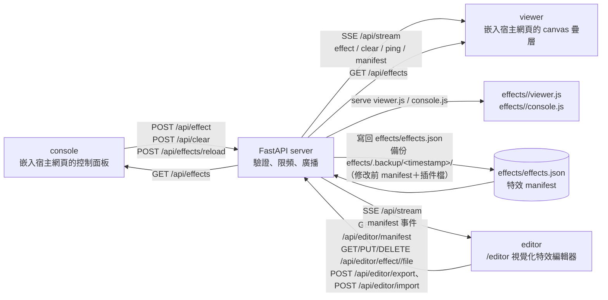

# Real-time Interaction html

即時網頁特效互動系統。將「console 操作端」與「viewer 顯示端」拆成可嵌入元件：console 送出特效、位置與參數，FastAPI server 負責驗證、限頻與廣播，多個 viewer 透過 SSE 接收事件，並在宿主網頁上以 canvas 疊層即時渲染。

## 專案特色

- **可嵌入 viewer**：只要一行 `<script>` 即可在任意網頁加上即時特效顯示層，canvas 不擋宿主網頁操作。
- **可嵌入 console**：以浮動按鈕＋面板控制特效，支援選特效、調參數、清屏、拖曳移動位置；console 可將特效放在「主要」與「次要」兩個區塊，並以 `localStorage` 記憶個人布局。
- **manifest 驅動特效**：特效清單集中在 `effects/effects.json`；正式 manifest 支援 version 1／2，version 2 以 `currentEffects`／`alternateEffects` 定義 console 雙區布局，個別特效可用 `enabled: false` 停用；新增特效主要新增 manifest entry 與 `effects/<id>/viewer.js`，不需改 server／console 核心。
- **manifest 手動重載**：`POST /api/effects/reload` 重新讀取 manifest 與插件 fingerprint；viewer 透過 SSE `manifest` 自動更新，console 於［連線設定］展開後點「重載」或頁面重新整理套用。
- **params schema 驗證**：server 依 manifest 參數型別驗證，無效值回退預設值。
- **多 viewer 廣播**：console 送出事件後，server 以 SSE 推送給所有已連線 viewer。
- **相對座標**：使用 viewport 0–100 百分比座標，viewer 自行換算成 canvas 像素。
- **可選存取金鑰**：server 可設定 `ACCESS_KEY`；未設定時全開放。POST API 使用 `X-Access-Key` header；SSE 使用 `?key=` query。
- **全域限頻**：`POST /api/effect` 使用滑動視窗限制（20/s）。
- **內建特效編輯器**：`/editor` 視覺化編輯 manifest、params、插件代碼；支援批次操作、zip／console 匯入匯出、即時預覽；寫入端點需存取金鑰並受獨立限頻（1 次/秒）。
- **完整自動化測試**：pytest 測 server API、node 測 viewer／console／編輯器邏輯、Playwright 測真實瀏覽器 E2E。

## 系統架構



主要流程：

1. viewer 載入 `effects/effects.json`，再動態載入各特效 `viewer.js`。
2. console 載入 `effects/effects.json`，建立特效按鈕與參數 UI。
3. 使用者選特效並點擊畫面，console 送出 `POST /api/effect`。
4. server 驗證 effect、params、金鑰與限頻後，廣播 SSE 事件。
5. viewer 收到事件後，在 canvas 疊層上渲染特效。
6. 使用者點清屏時，console 送出 `POST /api/clear`，viewer 清除目前特效。
7. manifest 或特效插件變更後，以 `POST /api/effects/reload` 手動重載；viewer 收到 SSE `manifest` 後自動更新插件，console 需展開［連線設定］後點［重載］，或重新整理頁面。
8. 維護者可於 `/editor` 視覺化編輯 manifest／params／插件代碼、批次操作、zip／console 匯入匯出，並即時預覽驗證；儲存即寫回 manifest（自動備份），viewer 經 SSE `manifest` 自動更新。

## 目錄結構

```text
project/
├── server/                  # FastAPI 中繼 server
│   ├── main.py              # API、SSE、存取金鑰、限頻、examples
│   ├── effects.py           # manifest 讀取、schema 驗證、catalog `rev` 與手動重載
│   ├── editor.py            # 特效編輯器 API（manifest／檔案／匯出匯入、獨立限頻）
│   ├── requirements.txt     # 執行依賴
│   └── requirements-dev.txt # 測試依賴
├── effects/                 # 正式特效插件與 manifest
│   ├── effects.json         # 正式特效清單
│   ├── particle/            # 粒子爆散
│   ├── ripple/              # 漣漪圈
│   ├── firework/            # 煙火
│   ├── text/                # 浮現文字
│   ├── slash/               # slash 特效
│   ├── vortex/              # vortex 特效
│   ├── chrono-vortex/       # chrono-vortex 特效
│   ├── tear-slash/          # tear-slash 特效
│   ├── rocket/              # rocket 特效
│   ├── pixel-melt/          # pixel-melt 特效
│   ├── hyper-warp/          # hyper-warp 特效
│   ├── aurora/              # aurora 特效
│   ├── fire-dragon/         # fire-dragon 特效
│   ├── orbital-strike/      # orbital-strike 特效
│   └── magic-circle/        # magic-circle 特效
├── viewer/                  # viewer 嵌入腳本
│   ├── app.js               # SSE 接收、canvas 管理、特效引擎載入
│   └── effects.js           # Effects registry、座標換算、render loop
├── console/                 # console 嵌入 UI
│   ├── app.js               # 控制面板、特效選擇、參數、POST 行為
│   ├── icons.js             # SVG icons
│   └── style.css            # console 樣式
├── editor/                  # 內建特效編輯器（/editor 視覺化編輯）
│   ├── index.html           # 三欄布局（列表／編輯／預覽）＋頂列
│   ├── app.js               # EditorPage：manifest、編輯保存、批次、zip、代碼、預覽
│   └── style.css            # 編輯器樣式
├── examples/                # opt-in 示範頁與新增特效範例
│   ├── index.html
│   ├── embed-viewer.html
│   ├── embed-console.html
│   ├── embed-both.html
│   ├── theme.css            # examples 淺色／深色主題
│   ├── theme.js             # examples 主題切換與 localStorage 記憶
│   └── effects/             # sample-burst、effect-interface 參考範例
├── tests/                   # 自動化測試
│   ├── conftest.py          # pytest path 設定
│   ├── test_api.py          # pytest：server API／manifest／SSE
│   ├── test_editor_api.py   # pytest：特效編輯器 API
│   ├── test_effects.mjs     # node：viewer 特效引擎
│   ├── test_console.mjs     # node：console DOM 行為
│   ├── test_editor.mjs      # node：編輯器 EditorPage 邏輯
│   ├── test_effect_examples.mjs
│   ├── test_effect_catalog.mjs
│   ├── fixtures/effects.json # v1 測試 manifest（固定原四特效）
│   ├── fixtures/effects-v2.json # v2 測試 manifest（layout 與 enabled 行為）
│   └── e2e/                 # Playwright 瀏覽器 E2E
├── docs/
│   ├── HOW_TO_ADD_EFFECT.md # 新增特效指南
│   └── agents/              # AI 協作流程、任務追蹤、架構圖與工作報告
└── playwright.config.js     # Playwright E2E 設定
```

## 快速開始

建立虛擬環境並啟動 server：

```bash
python -m venv .venv
.venv\Scripts\activate
pip install -r server/requirements.txt
python -m uvicorn server.main:app --port 8000
```

Linux／macOS 啟用 venv：

```bash
source .venv/bin/activate
```

如需執行測試，安裝測試依賴：

```bash
pip install -r server/requirements-dev.txt
npm install
```

## 環境變數

| 變數 | 預設 | 說明 |
| --- | --- | --- |
| `ACCESS_KEY` | （空） | 存取金鑰；空＝全開放。POST 用 `X-Access-Key` header、SSE 用 `?key=`；`/editor` 寫入端點同樣需 `X-Access-Key` |
| `RTX_EFFECTS_MANIFEST` | `effects/effects.json` | 特效 manifest 路徑覆寫 |
| `RTX_EFFECTS_DIR` | `effects` | 特效檔目錄覆寫（E2E 以此指向隔離的 `tmp/e2e-effects/`，避免測試改動正式 `effects/`） |
| `SERVE_EXAMPLES` | （停用） | `1`／`true`／`yes` 啟用 `/examples` 示範頁 |
| `RTX_LOG_LEVEL` | `INFO` | server log 層級（`DEBUG`／`INFO`／`WARNING`／`ERROR`）；無效值回退 `INFO` |
| `RTX_LOG_FILE` | `server.log` | log 檔路徑；設為空＝僅 console |
| `RTX_LOG_FILE_MAX_BYTES` | `5242880`（5 MB） | 輪替 log 單一檔案大小上限 |
| `RTX_LOG_FILE_BACKUP_COUNT` | `3` | 輪替 log 備份檔數量 |

## Log 參數設置

Server log 同時輸出至 console 與檔案（RotatingFileHandler），由「環境變數」表中 `RTX_LOG_*` 4 個變數控制：

- `RTX_LOG_LEVEL`：log 層級（`DEBUG`／`INFO`／`WARNING`／`ERROR`）；無效值回退 `INFO`。
- `RTX_LOG_FILE`：log 檔路徑（相對 server 啟動目錄），預設 `server.log`；設為空＝僅 console。
- `RTX_LOG_FILE_MAX_BYTES`：輪替單一檔案大小上限，預設 `5242880`（5 MB）；超過後依序輪替為 `<檔名>.1`、`<檔名>.2`…。
- `RTX_LOG_FILE_BACKUP_COUNT`：輪替備份檔數量，預設 `3`（即 `server.log` 與 `.1`~`.3`）；超出數量的舊備份刪除。
- log 檔的父目錄需已存在（不自動建立）；預設 `server.log` 位於啟動目錄，且 `.gitignore` 已忽略 `/server.log*`。

設定範例（於啟動 server 前設定）：

Windows：

```bat
set RTX_LOG_LEVEL=DEBUG
set RTX_LOG_FILE=logs\server.log
python -m uvicorn server.main:app --port 8000
```

Linux／macOS：

```bash
export RTX_LOG_LEVEL=DEBUG
export RTX_LOG_FILE=logs/server.log
python -m uvicorn server.main:app --port 8000
```

Log 統一格式為 `時間戳記 層級 logger 訊息`（ISO 8601、含時區；訊息以 `key=value` 事件欄位）。安全規則：log 不含 `ACCESS_KEY` 值與 client 參數值；`client` 欄位為 host-only。

編輯器相關審計事件：`editor_manifest_saved`（含 `rev`、`changed`、`created`、`removed`）、`editor_effect_created`（含 `effect`）、`editor_effect_removed`（含 `effect`、`files`）、`editor_file_saved`（含 `effect`、`file`、`changed`；刪除 console.js 時含 `deleted=true`）、`editor_export`（含 `count`）、`editor_import_rejected`（含 `reason`、`bytes`）、`editor_manifest_rejected`（含 `error`）。觸發限頻時統一記錄 `rate_limited`（含 `path`、`limit`）、金鑰錯誤記錄 `auth_denied`（含 `reason`）；409 版本衝突無專有事件。事件只記錄元資料，不含 manifest 本體、插件內容與金鑰。

## 嵌入 viewer

在目標網頁加入：

```html
<script src="http://<server-host>:8000/viewer/app.js"></script>
```

viewer 會建立 canvas 疊層，並自動連線 server SSE。SSE `open` 與 `manifest` 事件會依 `rev` 重新載入特效插件；manifest 更新時不會清除目前進行中的特效。若 server 設定 `ACCESS_KEY`，需於 URL 加 `?key=<access-key>` 或依嵌入情境提供金鑰。

## 嵌入 console

在控制端網頁加入：

```html
<link rel="stylesheet" href="http://<server-host>:8000/console/style.css">
<script src="http://<server-host>:8000/console/icons.js"></script>
<script src="http://<server-host>:8000/console/app.js" data-key="..."></script>
```

也可在載入 `console/app.js` 前定義：

```js
window.CONTROL_CONFIG = {
  url: "http://<server-host>:8000",
  key: "<access-key>"
};
```

console 面板於［連線設定］下拉面板內提供 SVG［重載］按鈕，手動呼叫 `POST /api/effects/reload` 後重新套用 manifest 與 console 插件。console 不透過 SSE 自動重載；重新整理頁面亦會取得最新 `rev` 與特效清單。

console 特效按鈕以 `#rtx-fx-current`（主要）與 `#rtx-fx-alternate`（次要）兩個區塊呈現；`#rtx-fx-layout-btn` 可展開或收合次要區塊。拖曳特效按鈕或呼叫 `window.__rtxConsoleLayout.move(effectId, "current" | "alternate", beforeId)` 可移動特效，個人布局寫入 `localStorage` key `rtx.fx.layout.v2`。layout 優先序為個人 `localStorage`、server 正規化 layout、v1／fallback 全 current；manifest reload 後會移除未知、停用或重複 effect IDs。

## 特效編輯器（`/editor`）

內建視覺化特效編輯器：啟動 server 後開啟 `http://<server-host>:8000/editor/`。三欄布局（左：特效列表、中：manifest／params／程式碼、右：即時預覽；窄視窗時主區橫向捲動、預覽欄維持最小寬）。以下為重點；詳見 `docs/agents/CALL_GRAPH.md`。

- **特效列表（左）**：依 manifest（v1／v2 雙區）載入；拖曳排序、批次啟用／停用／移區、刪除、新增特效（server 自動以模板產 `viewer.js`／`console.js`）；列表不顯示 icon。
- **編輯（中）**：meta（label／icon／enabled）、params schema（integer／number／string／color／boolean／select／array）、`viewer.js`／`console.js` 代碼；code 區 tab 可切 `effects.json`（選定特效單項）／`viewer.js`／`console.js`。
- **程式碼與檢查**：`viewer.js`／`console.js`／`effects.json` 編輯框含即時語法高亮；[暫存] staged、按 [保存至伺服器] 才寫入 server；未 [暫存] 的變更在切換特效／[重載]前彈 confirm 避免靜默捨棄、[重載]後刷新編輯框；[匯入]／[匯出] 標籤隨 tab，匯入後自動跑 [檢查格式]（單檔）與 [檢查 3 檔]（effects.json＋viewer.js＋console.js）。
- **即時預覽（右）**：canvas 以 `Effects.createEffect`／`stepEffect` 渲染；選定生成點以十字標記顯示（點 canvas 設定、預設 50/50、[重設 50/50] 還原）；簡化 console 面板（FAB 與面板 clamp 在 canvas 內、canvas 大小變化自動重 clamp、參數橫式布局對齊 console）；[開始預覽] 讀暫存/已存 console.js 渲染特效 icon＋參數（僅展示）、切換特效或 [重載] 清空；[開始預覽]／[清屏]（只清編輯器 canvas、不影響 viewer）／[測試特效]（以真實插件實際 smoke run）；插件碼於當前頁 realm 執行（非隔離沙箱），引用危險 API（`localStorage`／cookie／`fetch`／`eval` 等）者於預覽前顯示非阻斷「預覽預警」。
- **儲存**：`PUT /api/editor/manifest`（`baseRev` 樂觀鎖、可 `deleteRemoved`）＋ `PUT /api/editor/effect/{id}/file`（插件檔）；修改前備份至 `effects/.backup/<timestamp>/`（保留 5 份）；舊 `baseRev` 回 `409`、限頻回 `429`、無效 manifest 回 `400` 並回滾。
- **zip 匯入／匯出**：[匯出 effects.zip]（完整 manifest）／[匯出所選 effects.zip]（子集，zip 內 `effects.json` 只含所選 effects）；[匯入 effects.zip]（≤10 MB、staged、按 [保存至伺服器] 落盤，缺的插件檔自動補模板）。
- **金鑰與自動更新**：讀取端點公開、寫入端點需 `X-Access-Key`（首次輸入存 `localStorage`）；經 SSE `/api/stream` 接收 `manifest` 事件提示重載，變更狀態以 `#ed-dirty` 指標顯示（已同步／未暫存變更／未保存變更／保存中）；頂列連線 badge 顯示「連線中…」／「已連線 · vN」／「斷線」；SSE 斷流不影響連線顯示（icon/badge 跟隨 manifest、非 SSE）。

## 示範頁（examples，opt-in）

`examples/` 預設停用。啟用後可瀏覽嵌入示範頁：

PowerShell：

```powershell
$env:SERVE_EXAMPLES = "1"
python -m uvicorn server.main:app --port 8000
```

cmd：

```cmd
set SERVE_EXAMPLES=1 && python -m uvicorn server.main:app --port 8000
```

啟用後可存取：

- `http://localhost:8000/examples/`
- `http://localhost:8000/examples/embed-viewer.html`
- `http://localhost:8000/examples/embed-console.html`
- `http://localhost:8000/examples/embed-both.html`

各示範頁右上角提供淺色／深色主題切換；選擇會儲存在 `localStorage`，未手動切換時跟随系統偏好。

## 特效插件

正式特效清單位於 `effects/effects.json`。目前正式 manifest 為 `version: 2`，包含 15 個啟用特效；`currentEffects` 目前列出全部 15 個特效，`alternateEffects` 為空。個別特效可加 `enabled: false` 停用；停用時不進入 `GET /api/effects`、不被 viewer 載入、不被 `POST /api/effect` 接受，也不檢查該特效的 `viewer.js` 是否存在。

- `particle`、`ripple`、`firework`、`text`
- `slash`、`vortex`、`chrono-vortex`、`tear-slash`
- `rocket`、`pixel-melt`、`hyper-warp`
- `aurora`、`fire-dragon`、`orbital-strike`、`magic-circle`

每個特效至少需要：

- `effects/<id>/viewer.js`：註冊 `window.Effects.register(id, factory)`
- `effects/effects.json` 中的 manifest entry：宣告 `viewer`、`params` schema、icon 等資訊

選配：

- `effects/<id>/console.js`：自訂 console 參數 UI、icon、渲染邏輯

修改 `effects/effects.json` 或特效插件後，可呼叫 `POST /api/effects/reload` 手動重載；server 會以 manifest 與 `viewer.js`／`console.js` 內容計算 `rev`。未變更時 `changed` 為 `false`；驗證失敗時保留舊 catalog 並回傳 `400`。

新增特效請參考 `docs/HOW_TO_ADD_EFFECT.md`；完整範例在 `examples/effects/sample-burst/`，最小介面參考 `examples/effects/effect-interface/`。

自動測試（pytest／node vm／E2E）皆以 `tests/fixtures/` 為特效來源（自給自足：`effects.json` manifest＋特效檔），不依賴正式 `effects/`。其中 API／E2E 用原四特效（`particle`、`ripple`、`firework`、`text`），E2E 再把這 4 特效複製到隔離的 `tmp/e2e-effects/` 供 webServer 服務；node smoke 另含 3 個 canvas gradient 特效（`chrono-vortex`、`aurora`、`fire-dragon`）。唯一例外是 `tests/test_effect_catalog.mjs`（驗證**正式** `effects/` 的 catalog 一致性）。新特效加入正式 manifest 後，不會自動進入 API／E2E 預設測試。

## API 概述

| 路由 | 用途 |
| --- | --- |
| `GET /health` | 健康檢查 |
| `GET /api/effects` | 回傳 `rev`、`version`、清洗後啟用特效 manifest，以及正規化後的 `currentEffects`／`alternateEffects` |
| `POST /api/effects/reload` | 手動重載 manifest；變更時更新 catalog、廣播含 layout 的 SSE `manifest`，並回傳 `changed`、`rev` 與 effect id 清單 |
| `POST /api/effect` | 送出特效事件 |
| `POST /api/clear` | 清屏事件 |
| `GET /api/stream` | viewer SSE 串流（effect / clear / ping / manifest） |
| `GET /effects/effects.json` | 正式 manifest 檔案 |
| `GET /effects/{effect_id}/viewer.js` | 特效 viewer plugin |
| `GET /effects/{effect_id}/console.js` | 特效 console plugin（選用） |
| `GET /viewer/app.js`、`/viewer/effects.js` | viewer 嵌入資產 |
| `GET /console/app.js`、`/console/icons.js`、`/console/style.css` | console 嵌入資產 |
| `GET /editor` | 特效編輯器頁面（`/editor/` 同） |
| `GET /editor/app.js`、`/editor/style.css` | 編輯器資產 |
| `GET /api/editor/manifest` | 目前 manifest 與 `rev`（讀取公開） |
| `PUT /api/editor/manifest` | 寫入完整 manifest（`X-Access-Key`、可選 `baseRev`／`deleteRemoved`；舊 `baseRev` 回 409、限頻回 429） |
| `DELETE /api/editor/effect/{effect_id}` | 從 manifest 移除特效（可選 `deleteFiles=true` 連同刪除插件目錄） |
| `GET /api/editor/effect/{effect_id}/viewer.js`／`console.js` | 讀取特效插件檔（讀取公開） |
| `PUT /api/editor/effect/{effect_id}/viewer.js`／`console.js` | 寫入特效插件檔（`viewer.js` 不可空、`console.js` 可空＝無 console 插件；需 key、限頻） |
| `DELETE /api/editor/effect/{effect_id}/console.js` | 刪除 console 插件檔（需 key、限頻） |
| `POST /api/editor/export` | 匯出 zip（`ids` 非空時為子集；檔案優先取暫存 `files` 否則磁碟；讀取公開） |
| `POST /api/editor/import` | 匯入 zip（multipart `file`、≤10 MB；需 key、限頻；帶 layout 鍵時合併回現有 layout） |

## 測試

Python API／server 測試：

```bash
python -m pytest tests/ -q
```

Node viewer／console／編輯器邏輯測試：

```bash
node --test tests/test_effects.mjs tests/test_console.mjs tests/test_effect_examples.mjs tests/test_effect_catalog.mjs tests/test_editor.mjs
```

Playwright 瀏覽器 E2E：

```bash
npx playwright install chromium
npx playwright test
```

一次執行完整測試：

```bash
npm run test
```

目前測試數量：pytest 159 項（`test_api` 61、`test_server_logging` 13、`test_editor_api` 85）、node 237 項（`test_console` 72、`test_effect_examples` 16、`test_effects` 19、`test_effect_catalog` 2、`test_editor` 128）、Playwright E2E 87 項（`tests/e2e/editor.spec.js` 59 項）。

Playwright E2E 會自動啟動 server（port `8123`）；webServer 先經 `tests/e2e/pre-server-copy.mjs` 把 `tests/fixtures/` 的 4 特效複製到隔離的 `tmp/e2e-effects/`，並以 `RTX_EFFECTS_DIR` 指向該目錄（`tests/e2e/global-teardown.js` 測試後清理，E2E 全程不碰正式 `effects/`）；uvicorn stdout/stderr 重定向至 gitignored `e2e-server.log`。`tests/e2e/editor.spec.js`（59 項）驗證 `/editor` 全功能：manifest 載入／重載／SSE、meta/params 編輯保存與 409、批次操作、新增特效（effect_id 欄位）、zip 匯入匯出、代碼編輯、即時預覽與 timeline、[測試特效]、簡化 console 面板、格式檢查與狀態指標。其餘 spec 各管一題：`fx-layout`（console 雙區拖曳／FLIP 動畫／localStorage）、`fx-drag-trigger-distance`（8 方向拖曳觸發距離）、`fx-button-counts`（console 按鈕數）、`reload-manifest`（viewer 自動更新／console 手動重載）、`multi-console-reload`（多 console 獨立重載）、`effect-params`（參數輸入送 POST body）、`console-viewer-flow`（console→viewer 流程）、`examples-smoke`／`examples-theme-toggle`（examples 頁 smoke 與主題切換）。

## 文件

- `docs/HOW_TO_ADD_EFFECT.md`：新增特效指南
- `docs/agents/AGENTS.md`：AI 協作流程與交付規範
- `docs/agents/CALL_GRAPH.md`：系統架構與模組呼叫關係
- `docs/agents/TODO.md`：任務追蹤
- `docs/agents/reports/`：工作完成報告
