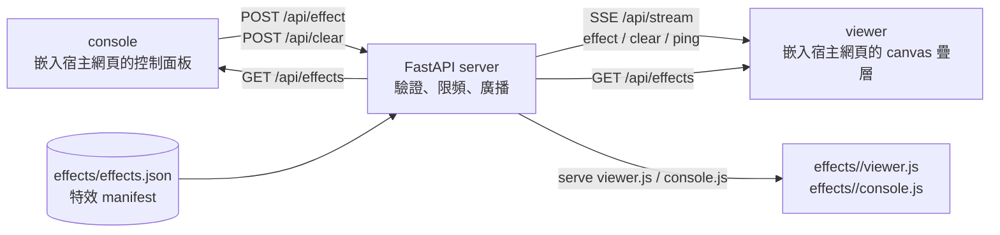

# Real-time Interaction html

即時網頁特效互動系統。將「console 操作端」與「viewer 顯示端」拆成可嵌入元件：console 送出特效、位置與參數，FastAPI server 負責驗證、限頻與廣播，多個 viewer 透過 SSE 接收事件，並在宿主網頁上以 canvas 疊層即時渲染。

## 專案特色

- **可嵌入 viewer**：只要一行 `<script>` 即可在任意網頁加上即時特效顯示層，canvas 不擋宿主網頁操作。
- **可嵌入 console**：以浮動按鈕＋面板控制特效，支援選特效、調參數、清屏、拖曳移動位置。
- **manifest 驅動特效**：特效清單集中在 `effects/effects.json`；新增特效主要新增 manifest entry 與 `effects/<id>/viewer.js`，不需改 server／console 核心。
- **params schema 驗證**：server 依 manifest 參數型別驗證，無效值回退預設值。
- **多 viewer 廣播**：console 送出事件後，server 以 SSE 推送給所有已連線 viewer。
- **相對座標**：使用 viewport 0–100 百分比座標，viewer 自行換算成 canvas 像素。
- **可選存取金鑰**：server 可設定 `ACCESS_KEY`；未設定時全開放。
- **全域限頻**：`POST /api/effect` 使用滑動視窗限制（20/s）。
- **完整自動化測試**：pytest 測 server API、node 測 viewer／console 邏輯、Playwright 測真實瀏覽器 E2E。

## 系統架構



主要流程：

1. viewer 載入 `effects/effects.json`，再動態載入各特效 `viewer.js`。
2. console 載入 `effects/effects.json`，建立特效按鈕與參數 UI。
3. 使用者選特效並點擊畫面，console 送出 `POST /api/effect`。
4. server 驗證 effect、params、金鑰與限頻後，廣播 SSE 事件。
5. viewer 收到事件後，在 canvas 疊層上渲染特效。
6. 使用者點清屏時，console 送出 `POST /api/clear`，viewer 清除目前特效。

## 目錄結構

```text
project/
├── server/                  # FastAPI 中繼 server
│   ├── main.py              # API、SSE、存取金鑰、限頻、examples
│   ├── effects.py           # manifest 讀取與 params schema 驗證
│   ├── requirements.txt     # 執行依賴
│   └── requirements-dev.txt # 測試依賴
├── effects/                 # 正式特效插件與 manifest
│   ├── effects.json         # 正式特效清單
│   ├── particle/            # 粒子爆散
│   ├── ripple/              # 漣漪圈
│   ├── firework/            # 煙火
│   ├── text/                # 浮現文字
│   ├── slash/               # slash 特效
│   ├── vortex/              # vortex 特效
│   ├── tear-slash/          # tear-slash 特效
│   └── rocket/              # rocket 特效
├── viewer/                  # viewer 嵌入腳本
│   ├── app.js               # SSE 接收、canvas 管理、特效引擎載入
│   └── effects.js           # Effects registry、座標換算、render loop
├── console/                 # console 嵌入 UI
│   ├── app.js               # 控制面板、特效選擇、參數、POST 行為
│   ├── icons.js             # SVG icons
│   └── style.css            # console 樣式
├── examples/                # opt-in 示範頁與新增特效範例
│   ├── index.html
│   ├── embed-viewer.html
│   ├── embed-console.html
│   ├── embed-both.html
│   └── effects/             # sample-burst、effect-interface 參考範例
├── tests/                   # 自動化測試
│   ├── conftest.py          # pytest path 設定
│   ├── test_api.py          # pytest：server API／manifest／SSE
│   ├── test_effects.mjs     # node：viewer 特效引擎
│   ├── test_console.mjs     # node：console DOM 行為
│   ├── test_effect_examples.mjs
│   ├── fixtures/effects.json # 測試用 manifest（固定原四特效）
│   └── e2e/                 # Playwright 瀏覽器 E2E
├── docs/
│   ├── HOW_TO_ADD_EFFECT.md # 新增特效指南
│   └── agents/              # AI 協作流程、任務追蹤、架構圖與工作報告
└── playwright.config.js     # Playwright E2E 設定
```

## 快速開始

建立虛擬環境並啟動 server：

```bash
python -m venv .venv
.venv\Scripts\activate
pip install -r server/requirements.txt
python -m uvicorn server.main:app --port 8000
```

Linux／macOS 啟用 venv：

```bash
source .venv/bin/activate
```

如需執行測試，安裝測試依賴：

```bash
pip install -r server/requirements-dev.txt
npm install
```

## 嵌入 viewer

在目標網頁加入：

```html
<script src="http://<server-host>:8000/viewer/app.js"></script>
```

viewer 會建立 canvas 疊層，並自動連線 server SSE。若 server 設定 `ACCESS_KEY`，需於 URL 加 `?key=<access-key>` 或依嵌入情境提供金鑰。

## 嵌入 console

在控制端網頁加入：

```html
<link rel="stylesheet" href="http://<server-host>:8000/console/style.css">
<script src="http://<server-host>:8000/console/icons.js"></script>
<script src="http://<server-host>:8000/console/app.js" data-key="..."></script>
```

也可在載入 `console/app.js` 前定義：

```js
window.CONTROL_CONFIG = {
  url: "http://<server-host>:8000",
  key: "<access-key>"
};
```

## 示範頁（examples，opt-in）

`examples/` 預設停用。啟用後可瀏覽嵌入示範頁：

PowerShell：

```powershell
$env:SERVE_EXAMPLES = "1"
python -m uvicorn server.main:app --port 8000
```

cmd：

```cmd
set SERVE_EXAMPLES=1 && python -m uvicorn server.main:app --port 8000
```

啟用後可存取：

- `http://localhost:8000/examples/`
- `http://localhost:8000/examples/embed-viewer.html`
- `http://localhost:8000/examples/embed-console.html`
- `http://localhost:8000/examples/embed-both.html`

## 特效插件

正式特效清單位於 `effects/effects.json`。目前正式 manifest 包含 8 個特效：

- `particle`
- `ripple`
- `firework`
- `text`
- `slash`
- `vortex`
- `tear-slash`
- `rocket`

每個特效至少需要：

- `effects/<id>/viewer.js`：註冊 `window.Effects.register(id, factory)`
- `effects/effects.json` 中的 manifest entry：宣告 `viewerUrl`、`params` schema、icon 等資訊

選配：

- `effects/<id>/console.js`：自訂 console 參數 UI、icon、渲染邏輯

新增特效請參考 `docs/HOW_TO_ADD_EFFECT.md`；完整範例在 `examples/effects/sample-burst/`，最小介面參考 `examples/effects/effect-interface/`。

自動測試預設使用 `tests/fixtures/effects.json`，只包含原四特效：`particle`、`ripple`、`firework`、`text`。新特效加入正式 manifest 後，不會自動進入預設測試。

## API 概述

| 路由 | 用途 |
| --- | --- |
| `GET /health` | 健康檢查 |
| `GET /api/effects` | 回傳特效 manifest（schema 已清洗） |
| `POST /api/effect` | 送出特效事件 |
| `POST /api/clear` | 清屏事件 |
| `GET /api/stream` | viewer SSE 串流 |
| `GET /effects/effects.json` | 正式 manifest 檔案 |
| `GET /effects/{effect_id}/viewer.js` | 特效 viewer plugin |
| `GET /effects/{effect_id}/console.js` | 特效 console plugin（選用） |
| `GET /viewer/app.js`、`/viewer/effects.js` | viewer 嵌入資產 |
| `GET /console/app.js`、`/console/icons.js`、`/console/style.css` | console 嵌入資產 |

## 測試

Python API／server 測試：

```bash
python -m pytest tests/ -q
```

Node viewer／console 邏輯測試：

```bash
node --test tests/test_effects.mjs tests/test_console.mjs tests/test_effect_examples.mjs
```

Playwright 瀏覽器 E2E：

```bash
npx playwright install chromium
npx playwright test
```

一次執行完整測試：

```bash
npm run test
```

Playwright E2E 會自動啟動 server（port `8123`），並使用 `tests/fixtures/effects.json`，因此預設不會把新特效納入測試。

## 文件

- `docs/HOW_TO_ADD_EFFECT.md`：新增特效指南
- `docs/agents/AGENTS.md`：AI 協作流程與交付規範
- `docs/agents/CALL_GRAPH.md`：系統架構與模組呼叫關係
- `docs/agents/TODO.md`：任務追蹤
- `docs/agents/reports/`：工作完成報告
