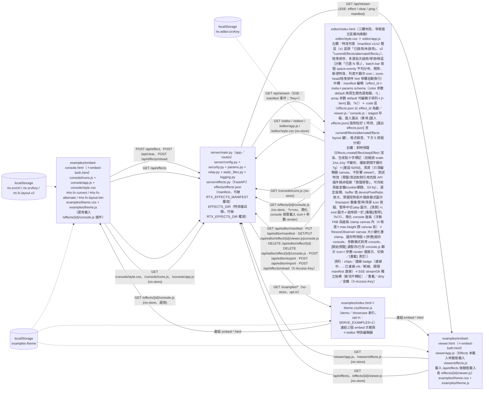
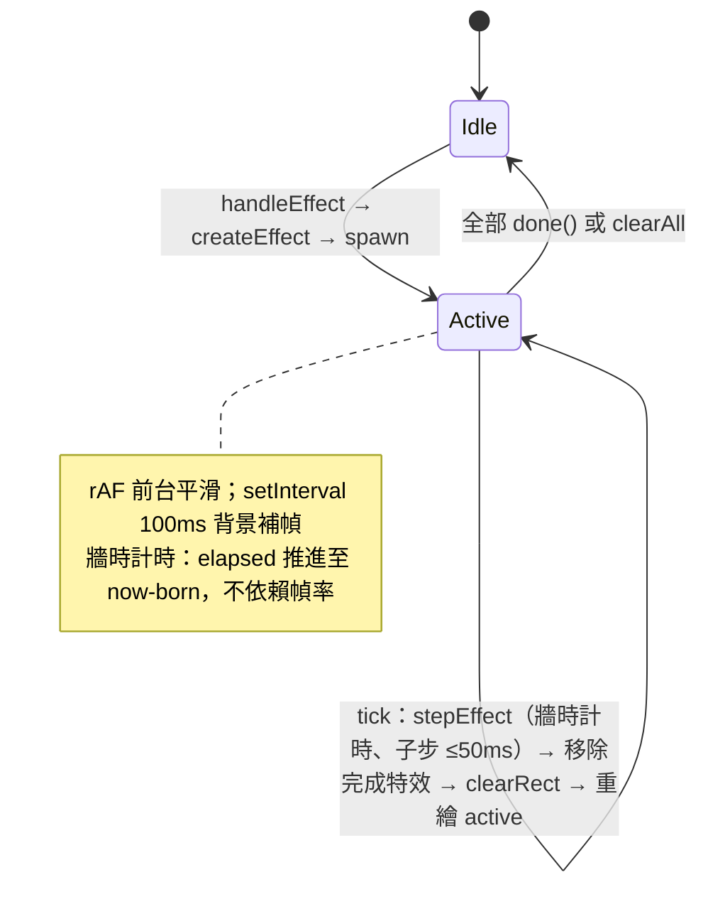
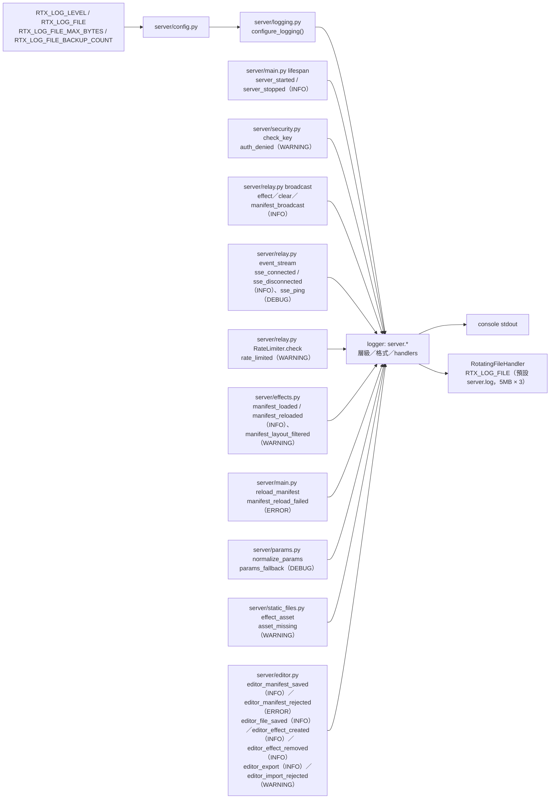

# Real-time Interaction html 函式呼叫關係圖

> 最後更新：2026-09-20

## 1. 整體架構



## 2. server 路由與請求驗證

> 節點依管線階層由上至下排列（進入點 → 驗證 → 廣播/串流），同階層以 subgraph 分組，錯誤回應與簡單回應各置獨立分組，避免關係線交錯。

```mermaid
flowchart TD
    subgraph entry["HTTP 進入點"]
        direction LR
        PE["POST /api/effect"]
        PC["POST /api/clear"]
        PR["POST /api/effects/reload"]
        ST["GET /api/stream"]
        H["GET /health"]
        LE["GET /api/effects"]
        JS["GET /viewer/app.js / /viewer/effects.js / /console/app.js / /console/icons.js / /console/style.css"]
        EF["GET /effects/effects.json / /effects/{id}/viewer.js / /effects/{id}/console.js"]
        EX["GET /examples / /examples/ / /examples/{path}"]
        ED["server/editor.py（editor router）<br/>GET /api/editor/manifest · PUT /api/editor/manifest（deleteRemoved：true＝刪全部 removed ids、false＝不刪、list[str]＝只刪列出的 removed ids）<br/>DELETE /api/editor/effect/{id} · GET/PUT /api/editor/effect/{id}/viewer.js|console.js（GET ?template=true 回 viewer/console 模板、__ID__ 置換、不落盤、PUT 內容 1MB 上限→413 S2）<br/>DELETE /api/editor/effect/{id}/console.js · POST /api/editor/export · POST /api/editor/import<br/>GET /editor / /editor/ / /editor/app.js / /editor/style.css"]
    end

    subgraph guard["驗證"]
        CK["check_key（server/security.py；POST 用 X-Access-Key、SSE 用 ?key=）"]
        VE{"effect 在 EFFECTS 中？"}
        NP["normalize_params（server/params.py；schema 驗證，無效值回退預設）"]
        RL["RateLimiter.check（server/relay.py；滑動視窗 20/s）"]
        RRL["reload_limiter.check（server/relay.py；滑動視窗 1/s）"]
        RE{"catalog fingerprint 變更？"}
        EN{"examples_enabled（server/static_files.py）：SERVE_EXAMPLES 啟用？"}
        EP{"effect_asset（server/static_files.py）：effect_id 合法＋檔案存在？"}
        ELL["editor_limiter.check（server/editor.py；滑動視窗 1/s，獨立於 rate_limiter）"]
    end

    subgraph push["廣播 / SSE 串流"]
        BC["broadcast（server/relay.py）：put_nowait 至各訂閱 queue"]
        SUB["add_subscriber（server/relay.py）：_subscribers.add(queue)"]
        GEN["event_stream（server/relay.py）：retry: 3000 → queue.get(timeout=15s)"]
        PING["yield event: ping（心跳）"]
        MSG["yield event: effect / clear / manifest"]
        DIS["remove_subscriber（server/relay.py）：_subscribers.discard(queue)（finally）"]
    end

    subgraph err["錯誤回應"]
        direction LR
        E401["HTTP 401 invalid access key"]
        E400["HTTP 400 unknown effect／manifest 驗證失敗／v1 manifest is read-only"]
        E429["HTTP 429 rate limit exceeded（Retry-After: 1）"]
        E404["HTTP 404 examples 停用／effects 資產不存在／editor 檔案缺失"]
        E409["HTTP 409 baseRev mismatch"]
        E413["HTTP 413 import file too large"]
    end

    subgraph plain["簡單回應"]
        direction LR
        OK["200 {ok, ts}"]
        LOK["200 {rev, version, effects, currentEffects, alternateEffects}"]
        RLOK["200 {ok, changed, rev, effects}"]
        FR["FileResponse（server/static_files.py；no-store）"]
        ELOK["200 {ok, changed, rev, created, effects}（editor 寫入）"]
        EZ["effects.zip（application/zip、attachment、no-store；ids 非空時 effects.json 只含所匯出 effects）"]
    end

    PE --> CK
    PC --> CK
    PR --> CK
    ST --> CK
    CK -- "金鑰不符" --> E401
    CK -- "effect 請求" --> VE
    CK -- "clear 請求" --> RL
    CK -- "reload 請求" --> RRL
    CK -- "stream 請求" --> SUB
    VE -- "否" --> E400
    VE -- "是" --> NP
    NP --> RL
    RL -- "超限" --> E429
    RL --> BC
    RRL -- "超限" --> E429
    RRL --> RE
    RE -- "否" --> RLOK
    RE -- "是（reload_effects → _apply_catalog → broadcast manifest）" --> RLOK
    SUB --> GEN
    GEN -- "15s 逾時" --> PING
    GEN -- "收到訊息" --> MSG
    GEN -. "循環：get → yield → get" .-> GEN
    GEN -. "斷線 → finally" .-> DIS
    H --> OK
    LE --> LOK
    JS --> FR
    EF --> EP
    EP -- "否" --> E404
    EP -- "是（解析路徑於 effects/ 內）" --> FR
    EX --> EN
    EN -- "否" --> E404
    EN -- "是（解析路徑於 examples/ 內）" --> FR
    ED -- "寫入端點（manifest/effect/檔案/import）" --> CK
    CK -- "editor 請求" --> ELL
    ELL -- "超限" --> E429
    ELL -- "通過" --> EDOP["Editor 處理（server/editor.py）<br/>v2／id／檔案內容驗證 → 新特效模板建檔、檔案原子寫入、.backup/&lt;timestamp&gt;/ 目錄備份（修改前 effects.json＋受影響插件檔修改前內容、保留 5、new==old 不備份）<br/>deleteRemoved（true／false／list[str]）刪 removed effects 目錄（備份 snapshot 先於 rmtree）<br/>reload_effects() → 變更時 broadcast manifest"]
    ED -- "讀取端點（manifest/檔案/export，免金鑰）" --> EDOP
    ED -- "GET /editor*（editor/ 不存在 → 404）" --> FR
    EDOP -- "baseRev 不符" --> E409
    EDOP -- "v1／驗證失敗／unknown effect" --> E400
    EDOP -- "import > 10MB" --> E413
    EDOP -- "檔案不存在" --> E404
    EDOP -- "changed" --> BC
    EDOP -- "未變更／讀取" --> ELOK
    EDOP -- "export" --> EZ
```



## 3. 即時互動序列（console → server → viewer）

```mermaid
sequenceDiagram
    autonumber
    participant C as console（console/app.js）
    participant S as server（server/main.py）
    participant V as viewer（viewer/app.js）

    Note over C: examples/embed-console.html（＋embed-both.html）載入 /console/style.css＋/console/icons.js＋/console/app.js\n初始化 → loadEffects() fetch /api/effects\n成功 → loadConsolePlugins()（依 consoleUrl 動態載入 /effects/{id}/console.js，失敗僅 log 回退）→ renderEffects(meta, payload, persist) 以 server 正規化 currentEffects／alternateEffects 渲染 #rtx-fx-current／#rtx-fx-alternate（icon 優先序：插件 iconSVG → 插件 iconID → manifest icon → RTX_EFFECT_ICONS[type] → generic → fallback；未知特效 generic）\nlayout 優先序：localStorage rtx.fx.layout.v2 → server payload layout → v1／fallback 全 current；sanitizeLayout() 移除未知、重複、disabled 與 stale IDs\n#rtx-fx-layout-btn → toggle #rtx-fx-alternate.open 並同步 #rtx-fx-layout.fx-locked（次要區關閉時 fx-locked）\npointerdown .rtx-fx → fxDragEnabled()（#rtx-fx-alternate 未 .open 時直接回傳，不 preventDefault、click 維持有效）→ 移動超過 DRAG_SLOP_PX 8px 激活 fxDrag（.rtx-fx.dragging、zIndex 30、pointerEvents none）→ window pointermove：fxZoneAt 決定 target zone（fxElementFromPoint 僅用於 zone 判斷 fallback）→ fxStoreLayoutRects() 以 fxMeasureLayoutRect() 刷新 __fxLayoutRect → fxInsertionRef：dragged button 在 target zone 時，僅在 pointer 距 non-dragged button center 在 FX_DRAG_TRIGGER_PX 30px 內才回傳 reorder ref（before／after 以 pointer x 與該按鈕 center 比較、nextAfter 取 row-major 順序），否則回傳維持目前位置的 ref；dragged button 不在 target zone 時以 fxLayoutRect／__fxLayoutRect 在 4 欄 grid 做 row-major 插入 → fxReorderTo 即時 reorder（target 順序與目前順序相等時跳過 insertBefore 與 FLIP；插入 DOM 後再 fxStoreLayoutRects()）＋fxFollowCursor 先 fxMeasureLayoutRect() 再 translate/scale(1.08) → pointerup／pointercancel：fxReleaseDrag → syncLayoutFromDom()／saveLayout()／renderFxZone() 並抑制下一次 click；window.__rtxConsoleLayout.move(effectId, targetBlock, beforeId) → moveEffect() → syncLayoutFromDom()／saveLayout()／renderFxZone()；renderFxZone 重建前先 fxStoreLayoutRects()，再於重建與 pointer reorder 即時移動播放 180ms FLIP 動畫 fxCaptureRects／fxPlayMove，prefers-reduced-motion: reduce 時停用\n失敗/空表 → fallback 內建特效\nrenderParams()：已註冊 console 插件優先 plugin.render()，否則依 schema 渲染（editable:false 與 array 不顯示）\nparamsBtn / connBtn → bindToggle()（展開時 applyFabPos()）\napplyFabPos() → panelCandidates() 選最小重疊位置；FAB z-index 高於 panel
    Note over V: examples/embed-viewer.html（＋embed-both.html）載入 /viewer/app.js\n/viewer/app.js 若 Effects 未載入會動態載入 /viewer/effects.js\nfetch /api/effects → 並行動態載入各 /effects/{id}/viewer.js（單一失敗僅 log 並跳過該特效）
    Note over C: 手動重載：展開 #rtx-conn-panel → 點擊 SVG #rtx-reload-btn → POST /api/effects/reload → GET /api/effects → applyManifest(rev, resetRegistry=true)
    C->>S: POST /api/effects/reload
    S->>S: check_key → reload_limiter.check(1) → reload_effects（fingerprint 未變則 changed=false；驗證失敗回 400 並保留舊 catalog；v2 layout 中 disabled ID 正規化時過濾並記 warning，不視為驗證錯誤）
    S-->>V: SSE event: manifest（changed=true 時，含 rev/effects）
    V->>V: loadViewerPlugins：Effects.reset → 依 rev cache-busting 載入 viewer.js；不清除 active effects
    C->>C: reloadEffectsTable：GET /api/effects → loadConsolePlugins → renderEffects
    C->>C: 選特效 → selectEffect() → renderParams()
    C->>C: 點擊 → paramsFor() 讀取 rtx-p-* 輸入
    C->>S: POST /api/effect {effect, x, y, params}
    S->>S: check_key → effect 驗證 → normalize_params（schema 驗證）→ RateLimiter.check → broadcast
    S-->>V: SSE event: effect
    V->>V: handleEffect：Effects.toPixels → Effects.createEffect → born/elapsed
    V->>V: spawn → tick（rAF＋setInterval 100ms）
    C->>S: POST /api/clear
    S-->>V: SSE event: clear
    V->>V: clearAll：active=[]＋clearRect＋log
    S-->>V: SSE event: ping（15s 無事件時）
    V->>V: lastPing 更新（逾 45s 未收到 ping → log 一次）
    Note over V: EventSource open/error → 連線狀態切換 log
```



## 4. viewer 特效渲染生命週期



## 5. 模組依賴與主要呼叫路徑

```mermaid
classDiagram
    class Effects {
        +registry
        +register(type, factory)
        +reset()
        +createEffect(type, px, py, params)
        +stepEffect(effect, targetElapsed, maxStep)
        +toPixels(x, y, w, h)
        +toPercent(px, py, w, h)
        +clamp(v, lo, hi)
    }
    class EffectPlugin {
        <<effects/<id>/viewer.js>>
        +factory(x, y, params) → Effect
    }
    class ConsolePlugin {
        <<effects/<id>/console.js（選用）>>
        +iconID（RTX_EFFECT_ICONS key）
        +iconSVG（raw SVG 字串）
        +render(container, api)
    }
    class Effect {
        +update(dt)
        +done()
        +draw(ctx)
        +born
        +elapsed
    }
    class Viewer {
        +boot()
        +resize()
        +tick()
        +spawn()
        +clearAll()
        +handleEffect(msg)
        +loadViewerPlugins(effects, rev)
    }
    class EffectCatalog {
        <<server/effects.py>>
        +MANIFEST
        +EFFECTS
        +MANIFEST_REV
        +MANIFEST_VERSION
        +MANIFEST_CURRENT_EFFECTS
        +MANIFEST_ALTERNATE_EFFECTS
        +load_manifest()
        +reload_effects()
    }
    class ServerConfig {
        <<server/config.py>>
        +ACCESS_KEY
        +RATE_LIMIT_PER_SEC
        +LOG_LEVEL / LOG_FILE / LOG_FILE_MAX_BYTES / LOG_FILE_BACKUP_COUNT
    }
    class Security {
        <<server/security.py>>
        +check_key()
    }
    class Params {
        <<server/params.py>>
        +normalize_params(effect_id, raw, effects)
    }
    class Relay {
        <<server/relay.py>>
        +add_subscriber(queue)
        +remove_subscriber(queue)
        +broadcast(msg)
        +event_stream(queue, is_disconnected)
    }
    class RateLimiter {
        <<server/relay.py>>
        +reset()
        +check(limit_per_sec)
    }
    class StaticFiles {
        <<server/static_files.py>>
        +file_response(path, media_type, detail)
        +effect_asset(effect_id, filename, client)
        +examples_enabled()
        +examples_response(path)
    }
    class Logging {
        <<server/logging.py>>
        +configure_logging(level, file_path, max_bytes, backup_count)
        +client_host(request)
        +resolve_level(level)
    }
    class EditorApi {
        <<server/editor.py>>
        +editor_limiter
        +VIEWER_TEMPLATE / CONSOLE_TEMPLATE
        +get_manifest()
        +put_manifest()
        +delete_effect()
        +read_effect_file()
        +write_effect_file()
        +delete_effect_console()
        +export_effects()
        +import_effects()
    }
    class Server {
        <<server/main.py>>
        +list_effects()
        +reload_manifest()
        +post_effect()
        +post_clear()
        +stream()
    }
    class Console {
        +fxLayoutState
        +saveCfg()
        +applyFabPos()
        +panelCandidates()
        +panelSize()
        +clampPanelPos(x, y, w, h)
        +overlapArea(a, b)
        +isSvgString(v)
        +resolvedPluginIcon(type)
        +iconFor(type, meta)
        +hasIconFor(type, meta)
        +uiIcon(name)
        +genericFields(params)
        +fieldDefs(type)
        +renderParams()
        +selectEffect(type)
        +fallbackLayout(effectKeys)
        +storedLayout()
        +saveLayout()
        +normalizeLayout(data)
        +sanitizeLayout(layout, effectKeys)
        +zoneTypes(zone)
        +fxCaptureRects()
        +fxLayoutRect(btn)
        +fxMeasureLayoutRect(btn)
        +fxStoreLayoutRects()
        +fxPlayMove(rects, skipBtn)
        +fxNextFrame(fn)
        +fxElementFromPoint(x, y)
        +fxZoneAt(x, y)
        +fxInsertionRef(zone, x, y, dragged)
        +fxReorderTo(x, y)
        +fxFollowCursor(x, y)
        +fxReleaseDrag()
        +fxEndPointer()
        +syncLayoutFromDom(preRects)
        +moveEffect(effectId, targetBlock, beforeId)
        +makeFxButton(type, zone)
        +renderFxZone(preRects)
        +renderEffects(meta, payload, persist)
        +normalizeEffects(data)
        +loadEffects()
        +loadConsolePlugins(meta, rev)
        +applyManifest(meta, rev, payload, resetRegistry)
        +reloadEffectsTable()
        +bindToggle(btn, box)
        +headers()
        +paramsFor()
        +post(path, body)
    }
    class EditorPage {
        <<editor/app.js>>
        +state{rev, baseRev, manifest, dirty, selected, conn, editable, batch, pendingDeletes, unsavedNew}
        +consoleRegistry{registry, register(type, plugin)}
        +pluginCache{id+rev → Promise}
        +loadManifest()
        +renderChips()
        +zones()
        +buildItem()
        +iconFor(id, spec)
        +resolvedPluginIcon(type)
        +loadConsolePlugin(id, spec, rev)
        +applyStagedConsole(id, content)
        +miniPos{miniOpen, miniDrag}
        +prepareMiniConsole()
        +renderMiniConsole()
        +renderMiniSchemaBody(body, spec)
        +miniConsoleApi()
        +clearMiniConsole()
        +miniInit()
        +miniToggle() / miniToggleParams()
        +miniApplyFabPos() / miniBounds() / miniClamp() / miniClampPos() / miniOverlap()
        +renderList()
        +selectItem(id)
        +setDirty(v)
        +setDirtyUI()
        +hasUnstagedCode()
        +postJson(path, body)
        +reloadManifest()
        +openStream()
        +injectIcons()
        +setOpsResult(text, kind)
        +setWarnings(text, kind)
        +setTestResult(text, kind)
        +setEditable(v)
        +renderMeta(id)
        +renderParams(id)
        +buildParamCard(key, spec)
        +fillR3(card, spec, type)
        +readCardSpec(card)
        +collectParams()
        +buildManifest()
        +applyManifestFields()
        +validateId(newId, currentId)
        +applyIdRekey()
        +nextEffectSerial()
        +syncMetaIdEditable()
        +putJson(path, body)
        +save()
        +selectTab(name)
        +renderManifestView()
        +selectedEffectEntry()
        +effectEntryJson(id)
        +toggleBatch(id, on)
        +syncBatchUI()
        +commitMove(effectId, beforeId, toZone)
        +setEnabled(id, enabled)
        +removeEffect(id)
        +batchApply(field, value)
        +batchMove(zone)
        +newEffect()
        +exportZip(ids, asFull)
        +importZip(inputEl)
        +stageImport(data)
        +initListDrag()
        +codeFilePath()
        +showCode(text)
        +renderLineNumbers(text)
        +highlightJs(text)
        +renderHighlight()
        +loadCodeFile()
        +saveFile()
        +writePendingCode()
        +importFile()
        +doImportFile(inputEl)
        +doImportEntry(inputEl)
        +entryIdFromFilename(name)
        +selectedEffectFileJson()
        +exportSource(id, filename)
        +exportFile()
        +previewStart(reusePlugin)
        +previewViewerSource(id)
        +testEffect()
        +runEffectTest()
         +previewStop()
         +previewClear()
         +previewTick()
         +renderPreviewControls()
         +previewPauseToggle()
         +previewReplay()
         +previewSetRate(r)
         +previewState()
         +collectPreviewParams()
        +onPreviewClick()
        +onCodeSaved()
        +renderPreviewLabel()
        +syncCodeEditable()
        +importExportLabel(isImport)
        +undoPendingDelete(index)
        +checkSingleFile()
        +checkAllFiles()
        +computeCheck(id, files, allowFetch)
        +displayCheck(lines, prefix)
        +checkEffectsEntry(id, entry, errors, warnings)
        +checkViewerSource(id, source, entry, errors, warnings)
        +checkConsoleSource(id, source, entry, errors, warnings)
    }
    Viewer ..> Effects : toPixels / createEffect / stepEffect
    EditorPage ..> Effects : ensureEffectsCore 載入 /viewer/effects.js、injectPlugin 載入 /effects/{id}/viewer.js、createEffect / stepEffect
    EditorPage ..> Server : GET /api/editor/manifest / PUT /api/editor/manifest / GET-PUT /api/editor/effect/{id}/viewer.js|console.js / DELETE /api/editor/effect/{id} / POST /api/editor/export / POST /api/editor/import / POST /api/effects/reload / POST /api/effect / POST /api/clear / GET /api/stream（SSE manifest 事件）/ GET /effects/{id}/console.js（簡化 console 按需載入 icon＋參數 render、?v=rev）
    EditorPage ..> EditorApi : manifest 讀取（editor router）
    EffectPlugin ..> Effects : register(type, factory)
    Effects ..> Effect : 依 manifest 動態建立 effects/*/viewer.js 特效
    Console ..> ConsolePlugin : 選用 render／iconID／iconSVG（缺失時 schema 渲染／manifest icon）
    Console ..> Server : POST /api/effect / POST /api/clear / POST /api/effects/reload
    Server ..> EffectCatalog : 讀取 EFFECTS / MANIFEST / MANIFEST_REV / MANIFEST_VERSION / MANIFEST_CURRENT_EFFECTS / MANIFEST_ALTERNATE_EFFECTS / MANIFEST_PATH；reload_effects()
    Server ..> ServerConfig : ACCESS_KEY / RATE_LIMIT_PER_SEC
    Server ..> Security : check_key()
    Server ..> Params : normalize_params()
    Server ..> Relay : add_subscriber / broadcast / event_stream
    Server ..> RateLimiter : rate_limiter.check() / reload_limiter.check(1)
    Server ..> StaticFiles : file_response / effect_asset / examples_response
    Server ..> Logging : configure_logging() / client_host()
    Logging ..> ServerConfig : LOG_LEVEL / LOG_FILE / LOG_FILE_MAX_BYTES / LOG_FILE_BACKUP_COUNT
    Params ..> EffectCatalog : effects 參數缺省時讀取 EFFECTS
    EffectCatalog ..> EffectPlugin : manifest 宣告 /effects/<id>/viewer.js
    Server ..> Viewer : SSE effect / clear / ping / manifest
    Server ..> EditorApi : app.include_router（editor router）
    EditorApi ..> EffectCatalog : 動態讀取 MANIFEST / EFFECTS / MANIFEST_PATH / EFFECTS_DIR / MANIFEST_REV；_validate_manifest() / reload_effects()
    EditorApi ..> ServerConfig : ACCESS_KEY
    EditorApi ..> Security : check_key()（寫入端點，X-Access-Key）
    EditorApi ..> Relay : editor_limiter.check() / broadcast()
    EditorApi ..> StaticFiles : file_response()
```

## 6. 測試關係

```mermaid
flowchart LR
    TF["tests/fixtures/effects.json＋effects-v2.json<br/>v1／v2 測試 manifest"]
    TA["tests/test_api.py<br/>pytest＋TestClient（61）<br/>v1／v2 fixture manifest、enabled filtering、layout 正規化、disabled-in-layout 過濾回歸、SSE manifest 結構、temp reload manifest、caplog 事件 log（broadcast／SSE／rate_limited／auth_denied／manifest／params_fallback／asset_missing）"] --> M["server/main.py<br/>＋server/config.py、security.py、params.py、relay.py、static_files.py、effects.py"]
    TA --> TF
    TED["tests/test_editor_api.py<br/>pytest＋TestClient（85）<br/>tmp v2 manifest、GET/PUT manifest（baseRev 409、未變更 no-op、rollback、deleteRemoved list[str] 只刪列出 removed ids／忽略非 removed）、effect 刪除、viewer/console 檔讀寫刪除、新特效模板、export zip（ids 非空→effects.json 子集、ids 空→完整 manifest）、import zip（zip slip、too large、rollback）、subset export round-trip（匯出片段→移除特效→匯入還原）、.backup/&lt;timestamp&gt;/ 目錄備份（修改前 manifest＋受影響插件檔、PUT/DELETE 檔案端點觸發、無變更不備份、保留 5）、static 404、空檔內容（viewer.js 不可空→400／console.js 可空→200，B6 6u）、PUT 檔案內容 1MB 上限→413（S2 6x）、caplog editor_* 事件"] --> M
    TED --> TF
    TS["tests/test_server_logging.py<br/>pytest（13）<br/>configure_logging／client_host／resolve_level、env 覆蓋、idempotent、lifespan log"] --> LG["server/logging.py"]
    LG --> M
    TE["tests/test_effects.mjs<br/>node --test＋vm（19）<br/>含 editor VIEWER_TEMPLATE smoke（模板可 register 並建立特效）"] --> S["viewer/effects.js ＋ tests/fixtures/*/viewer.js"]
    TC["tests/test_console.mjs<br/>node --test＋vm DOM stub（72）<br/>v1／v2 payload、雙區渲染、layout button（含 fx-locked 同步）、fx move 動畫、次要區關閉時拖曳停用、pointer drag row-major insertion、slop／click suppression／pointercancel、move hook、localStorage"] --> K["console/app.js ＋ tests/fixtures/*/console.js"]
    TX["tests/test_effect_examples.mjs<br/>node --test＋vm fake sandbox（16）"] --> X["examples/effects/*/effects.json ＋ viewer.js ＋ console.js"]
    TG["tests/test_effect_catalog.mjs<br/>node --test＋vm（2）<br/>正式 effects/effects.json、effects/*/viewer.js、選用 console.js"] --> S_REAL["正式 effects/（effects.json＋*/viewer.js＋選用 console.js）"]
    TG --> K
    TEX["tests/test_editor.mjs<br/>node --test＋vm fake DOM（128）<br/>manifest 載入/chips/連線（U9 badge 連線中…過渡態＋U13 SSE 斷流不轉紅/streamOk 獨立）、v1/v2/disabled 分區、srvKey＋X-Access-Key＋SSE、dirty＋beforeunload、重載（429 重試）、meta/params 編輯保存（409/429）、批次/拖曳/新增/移除 staged、P1 列表就地協調（復用／移動既有節點＋保 identity）、S1 待刪除/已刪除專屬區（renderPendingZone、head 計數、↺ 還原）、code 區 loadCodeFile/saveFile staged/匯入匯出（effects.json 單項、raw entry、模板 404）、格式檢查（effects/viewer/console validators＋3 檔）、即時預覽（createEffect/stepEffect/選定座標/生成點十字標記（反縮放 scale 1/sx,1/sy 不變形）＋[重設 50/50]／高 DPR buffer/清屏）、簡化 console 面板（prepareMiniConsole staged render／schema fallback、切換清空、FAB 折疊、面板 clamp canvas 內（4 候選＋max-height）＋ResizeObserver 重 clamp）、真實特效 smoke run（gradient ctx stub，讀 tests/fixtures/*/viewer.js）、exportSource staged 優先＋iconFor 優先序、effect_id re-key（applyIdRekey/validateId/nextEffectSerial、unsavedNew 僅新增可改／既有不可改名）＋effects.json 預覽以 id 為鍵＋applyManifestFields 套用欄位、B6 空檔（viewer.js 不可[暫存]空／console.js 可[暫存]空＋exportSource 回空 staged）＋匯入 .js 後自動跑格式檢查（U12）＋程式碼語法高亮（highlightJs token 化 keyword/control/string/number/comment＋HTML 跳脫＋底層 <pre> 渲染、textarea 透明，6v）＋結果區合併（setWarnings/setTestResult 併入 #ed-ops-result、移除 #ed-warnings，6w）＋U14 復原待刪重複 id 顯示錯誤＋待刪項保留（6x）＋S3 預覽前危險 API 靜態預警（previewDangerScan、staged viewer/console＋[測試特效] 非阻斷「預覽預警」、6y）＋scroll 同步改 transform（底層 code／gutter inner 平移、不經 scrollTop clamp、6z）＋批次列計數常顯示（syncBatchUI 常顯「已選 N 項」、未選取亦「已選 0 項」、7b）＋操作結果訊息中文化（setWarnings／displayCheck 英文→中文，技術詞保留，7a/7b）＋拖曳把柄限 grip（draggable／dragstart／dragend 移至 grip、setDragImage 顯示整條項目、7c）＋#ed-dirty 四態指標（加 unstaged「未暫存變更」、優先序 saving>unstaged>dirty>clean、7d）＋[保存至伺服器] 一律 confirm（有未暫存警告不會保存到伺服器、取消不 PUT；保存成功在 viewer/console tab 重抓 code 更新基準、7d）＋preview timeline（vtime 驅動 stepEffect、速率滑桿 0.25×–4×／暫停/繼續／重播、renderPreviewControls 控制狀態同步、previewState 掛鉤、7e）＋preview timeline UX（速率滑桿常可調、[重播] 已預覽且為目前選定即啟用（preview.loadedId===state.selected）、previewStart(reusePlugin) 重用已載入插件不重請求 .js、控制列合併單一 .actions 列、7f）＋播放期間不顯示生成點十字標記（previewTick 不畫 marker、停止後重現、7g）＋預覽控制影片撥放器式圖示（transport 重播/暫停/清屏 icon 按鈕（data-ui-icon replay/pause/end）、暫停中切 play 圖示＋aria-label、7h）＋[清屏] >| end 圖示、啟用邏輯統一於 [重播][暫停]（!(loadedId && loadedId===selected)）、結果訊息「已清除預覽畫面」（7i）＋params 卡 color 參數 default 原生顏色選取器（buildDefaultInput：type=color 時 input[type=color]＋type 切換 replaceChild 重建，7j）＋array 參數 default 子項列（buildDefaultInput array 分支→span.p-opts 行＋[+ item] 鈕、buildOptRow(val, rmTitle) ✕ 刪行、readArrayDefault 依 .p-items 型別轉值＋跳過空值，7k）＋簡化 console schema fallback 參數可編輯輸入（renderMiniSchemaBody 渲染 input/select、id rtx-p-<key>、type 映射 boolean→checkbox/color/number/text＋select 支援 string/{value,label}，7l）＋previewStart 先調 applyManifestFields 同步未存 manifest 欄位到參數面板與預覽（stale value 修正，7l）＋7m 兩段式變更指示器（state.unstagedFields＋setFieldsUnstaged：manifest 欄位 input/change→unstaged「未暫存變更」、applyManifestFields（[暫存]）套用→dirty「未保存變更」、[保存至伺服器]→clean「已同步」、優先序 saving>unstaged>dirty>clean；切換特效／renderMeta／renderParams 重繪／匯入（staged）清空 flag；保存失敗 400 仍 unstaged）＋[新增特效] staged→「未保存變更」＋newEffect 調 clearMiniConsole（FAB 收合、name/icon/參數內容清空、直到下次 [開始預覽]）＋保留自動標籤「新特效 N」）＋7n 未暫存變更 切換特效／[新增特效]／匯入先 confirm（`unstagedDiscardMsg` helper：code only／fields only／both 三訊息；fx-item click 切換特效、`newEffect`、`importZip`、`doImportEntry` confirm、取消中止；`newEffect` 重繪後補 `setDirtyUI()` 重算四態指示）"] --> EPE["editor/app.js<br/>＋editor/index.html（fake DOM）<br/>＋tests/fixtures/*/viewer.js（真實特效 smoke）"]
    TP["tests/e2e/*.spec.js<br/>Playwright E2E（87）<br/>預設 webServer port 8123（stdout/stderr→e2e-server.log、測試輸出乾淨、RTX_EFFECTS_DIR→tmp/e2e-effects（pre-server-copy.mjs 自 tests/fixtures/［manifest＋4 特效檔］複製 4 特效、不碰正式 effects/、globalTeardown 清理））<br/>fx-layout.spec.js：v2 雙區拖曳/FLIP 動畫/次要區關閉停用/localStorage<br/>fx-drag-trigger-distance.spec.js：8 方向 pointer 拖曳觸發距離（約 30px）<br/>reload-manifest.spec.js：獨立 server（RTX_EFFECTS_DIR→tests/fixtures/）＋temp manifest、viewer 自動更新<br/>multi-console-reload.spec.js：兩獨立 server（RTX_EFFECTS_DIR→tests/fixtures/）/key、selected fallback<br/>editor.spec.js（59）：editor 骨架、U13 SSE 斷流不轉紅（abort /api/stream→reload→#ed-conn 仍 ok、不轉 err）、U10 effect_id 欄位（新增預設流水號可改／既有只讀、[暫存] re-key＋effects.json 預覽顯示 id、5 按鈕分組）、U7 按鈕改名（[暫存]/[保存至伺服器]）＋#ed-dirty 四態（已同步/未保存變更/未暫存變更/保存中，7d）、6j 程式碼未[暫存]變更（編輯即 dirty／切換特效+重載 confirm 避免靜默捨棄／重載後刷新編輯框）、B2 拖曳指示線 accent 色、B8 短視窗 zone 不溢出、B9 拖曳指示線隨 cursor 落正確項目、B7 .rsz 對側欄等量收縮、B10 .rsz 觸底總寬守恆、P1 列表就地協調（復用節點 identity）、manifest 載入/重載/SSE、meta/params 編輯保存（409）、drag/batch/new/import/export（staged→[保存至伺服器]）、code 編輯（viewer/console 載入/暫存/匯出＋匯入 .js 後自動跑格式檢查 U12）＋語法高亮（底層 <pre> token 上色＋textarea 透明＋隨輸入重繪＋scroll 同步改 transform 平移不經 scrollTop clamp，6v/6z）、P3 存檔單一原子 PUT（manifest 含 files）、即時預覽（createEffect/清屏）、格式檢查、簡化 console 面板（U15：FAB 收合/展開、[開始預覽] icon＋參數 render、切換清空、canvas 縮小 .rsz→FAB/面板重 clamp canvas 內）、effects.json tab 單項＋匯入匯出、[測試特效] 結果區、staged 匯出、S1 待刪除/已刪除專屬區（B8 zone 2→3、removeEffect 斷言 #ed-zone-pending）＋結果區合併（setWarnings/setTestResult 訊息併入 #ed-ops-result，6w）＋批次測試補初始「已選 0 項」計數斷言（7b）＋拖曳測試改自 .grip 起手（7c）＋7d [保存至伺服器] confirm（有未暫存→取消不 PUT／確認→PUT 且編輯框回到 server 基準；既有保存測試 confirm 自動接受）＋7e preview timeline（速率滑桿 0.25×–4×／暫停/繼續／重播＋控制狀態同步，ripple fixture 確定性 1200ms、pause 凍結驗證）＋7f preview timeline UX（速率常啟用、重播重用已載入插件：viewer.js 請求計數恆＝1 不重請求、auto-stop／清屏後重播仍啟用）＋7h 預覽控制影片撥放器式圖示（transport 3 圖示鈕 SVG 渲染＋aria-label、暫停中切 play 圖示）＋7i [清屏] >| end 圖示＋title「結束預覽並清除畫面」＋啟用邏輯統一於 [重播][暫停]（初始 disabled→預覽後啟用、停止後仍啟用）＋訊息「已清除預覽畫面」＋7j color 參數 default 顏色選取器（v1 唯讀 input[type=color] 渲染、v2 type color→string→color 重建）＋7k array 參數 default 子項列（v1 4 行唯讀＋[+ item] disabled、v2 新增／刪除行＋type array→string→array 重建）＋7l 簡化 console 參數可編輯輸入（v3：firework 無 console.js → 簡化 console 亦渲染 input/select 可編輯框、未存參數變更 90→120 亦反映於參數面板）＋7m 兩段式變更指示器（manifest 欄位編輯→未暫存變更、[暫存]→未保存變更、[保存至伺服器] PUT 含編輯欄位→已同步＋fixture 落盤；[新增特效] staged→未保存變更、清空簡化 console（FAB 收合、name/icon/參數內容空）、保留自動標籤「新特效 N」；block 加 beforeAll/afterEach fixture snapshot/restore 防 fullyParallel 跨 test 污染）＋7n 未暫存變更 切換特效／[新增特效]／匯入先 confirm（欄位未暫存→切換特效 confirm 取消不切換／確認切換丟棄變更、[新增特效] confirm、zip 匯入 confirm＋選取切到匯入 effect；既有測試 B 斷言改新統一訊息）"]
    TP --> K
    TP --> S
    TP --> TF
```



## 7. 未完成或未接線節點

| 節點 | 現況 |
| --- | --- |
| server 暫存最近 N 則（斷線重播） | 未實作（規格：預設不重播） |
| viewer 狀態回報（POST /api/status） | 未實作（規格：僅 log） |
| `editor/` 頁面（三欄 UI） | 已實作：`server/editor.py` API（manifest GET/PUT、插件檔讀寫/刪除、新特效模板、zip 匯入匯出、`.backup/` 備份、獨立 1/s 限頻、X-Access-Key）＋ `editor/` 三欄 UI（特效列表 拖曳/批次/新增/icon、meta/params 編輯、effect_id 欄位（新增預設流水號＋[暫存] re-key）、code 區 effects.json（以 effect_id 為鍵）/viewer.js/console.js staged 暫存＋未[暫存]變更確認（編輯即 dirty、切換特效/重載 confirm、重載後刷新編輯框）＋匯入匯出＋格式檢查＋語法高亮（底層 <pre> token 上色、textarea 透明、wrap=off、Tab 縮排、scroll 同步改 transform 平移（底層 code／gutter inner、不經 scrollTop clamp，6z））、即時預覽＋清屏（只清編輯器 canvas）＋[測試特效]）；staged 保存（[保存至伺服器]才寫 server）、備份、409/429/400。逐項功能與歷史變更見 reports 069–098 與 git。 |
| examples/effects/*（sample-burst、effect-interface） | 僅為新增特效的參考範例（docs/HOW_TO_ADD_EFFECT.md），未登記於正式 manifest `effects/effects.json`，server 不服務 |

執行測試：

```
python -m pytest tests/ -q
node --test tests/test_effects.mjs tests/test_console.mjs tests/test_effect_examples.mjs tests/test_effect_catalog.mjs tests/test_editor.mjs
npx playwright test
```

## 8. 日誌事件與輸出流

所有 log 由 `server` logger 樹（`server.<module>`）發出；handler 僅掛於 `server` logger（`configure_logging()`，`server/logging.py:27-52`，於 `server/main.py:15` import 階段呼叫）。輸出：console StreamHandler＋RotatingFileHandler（預設 `server.log`，`RTX_LOG_FILE` 設為空可停用檔案輸出）。



安全規則：log 不含 `ACCESS_KEY` 值與 client 參數值；`client` 欄位為 host-only（`client_host()` 優先 `X-Forwarded-For` 第一跳）。
