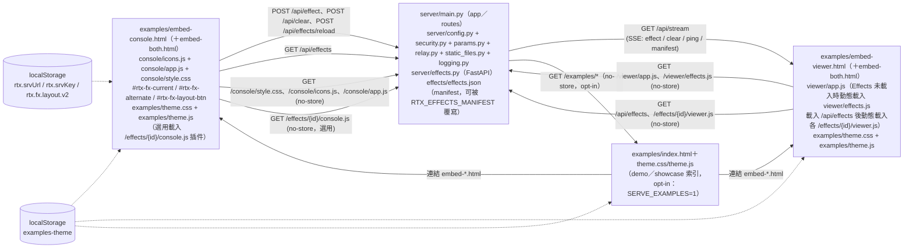
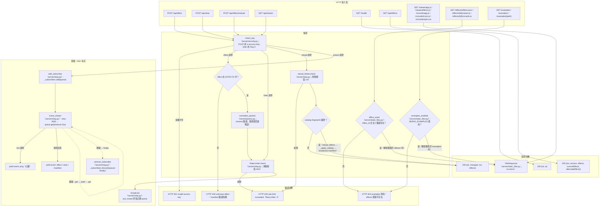
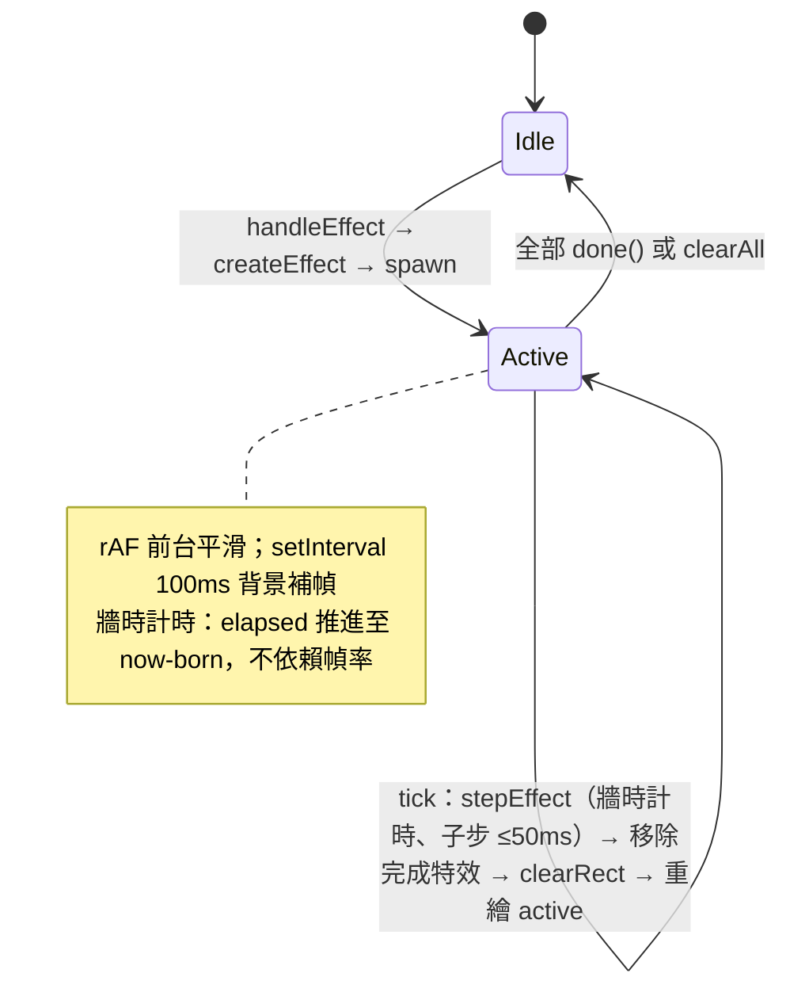
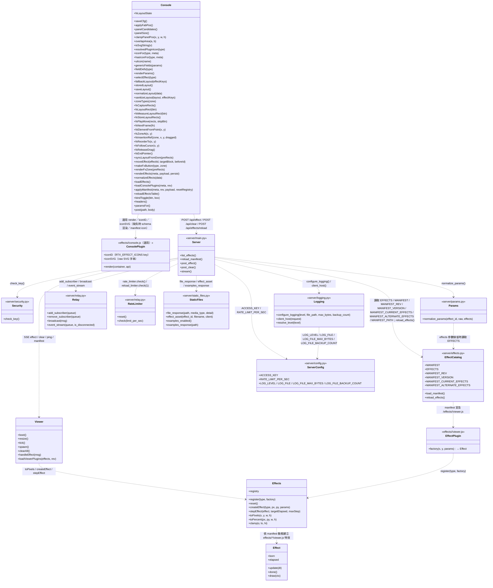
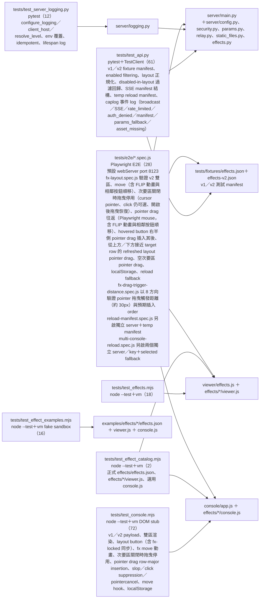
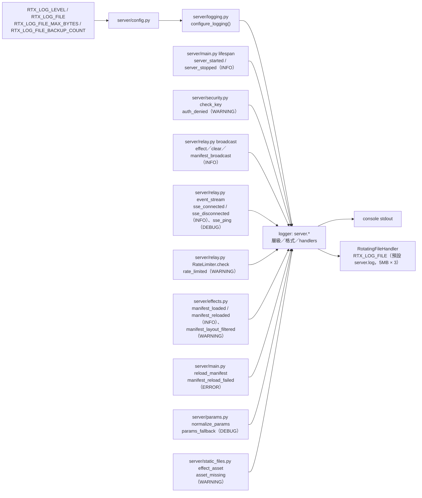

# Real-time Interaction html 函式呼叫關係圖

> 最後更新：2026-09-15

## 1. 整體架構



## 2. server 路由與請求驗證

> 節點依管線階層由上至下排列（進入點 → 驗證 → 廣播/串流），同階層以 subgraph 分組，錯誤回應與簡單回應各置獨立分組，避免關係線交錯。



## 3. 即時互動序列（console → server → viewer）

```mermaid
sequenceDiagram
    autonumber
    participant C as console（console/app.js）
    participant S as server（server/main.py）
    participant V as viewer（viewer/app.js）

    Note over C: examples/embed-console.html（＋embed-both.html）載入 /console/style.css＋/console/icons.js＋/console/app.js\n初始化 → loadEffects() fetch /api/effects\n成功 → loadConsolePlugins()（依 consoleUrl 動態載入 /effects/{id}/console.js，失敗僅 log 回退）→ renderEffects(meta, payload, persist) 以 server 正規化 currentEffects／alternateEffects 渲染 #rtx-fx-current／#rtx-fx-alternate（icon 優先序：插件 iconSVG → 插件 iconID → manifest icon → RTX_EFFECT_ICONS[type] → generic → fallback；未知特效 generic）\nlayout 優先序：localStorage rtx.fx.layout.v2 → server payload layout → v1／fallback 全 current；sanitizeLayout() 移除未知、重複、disabled 與 stale IDs\n#rtx-fx-layout-btn → toggle #rtx-fx-alternate.open 並同步 #rtx-fx-layout.fx-locked（次要區關閉時 fx-locked）\npointerdown .rtx-fx → fxDragEnabled()（#rtx-fx-alternate 未 .open 時直接回傳，不 preventDefault、click 維持有效）→ 移動超過 DRAG_SLOP_PX 8px 激活 fxDrag（.rtx-fx.dragging、zIndex 30、pointerEvents none）→ window pointermove：fxZoneAt 決定 target zone（fxElementFromPoint 僅用於 zone 判斷 fallback）→ fxStoreLayoutRects() 以 fxMeasureLayoutRect() 刷新 __fxLayoutRect → fxInsertionRef：dragged button 在 target zone 時，僅在 pointer 距 non-dragged button center 在 FX_DRAG_TRIGGER_PX 30px 內才回傳 reorder ref（before／after 以 pointer x 與該按鈕 center 比較、nextAfter 取 row-major 順序），否則回傳維持目前位置的 ref；dragged button 不在 target zone 時以 fxLayoutRect／__fxLayoutRect 在 4 欄 grid 做 row-major 插入 → fxReorderTo 即時 reorder（target 順序與目前順序相等時跳過 insertBefore 與 FLIP；插入 DOM 後再 fxStoreLayoutRects()）＋fxFollowCursor 先 fxMeasureLayoutRect() 再 translate/scale(1.08) → pointerup／pointercancel：fxReleaseDrag → syncLayoutFromDom()／saveLayout()／renderFxZone() 並抑制下一次 click；window.__rtxConsoleLayout.move(effectId, targetBlock, beforeId) → moveEffect() → syncLayoutFromDom()／saveLayout()／renderFxZone()；renderFxZone 重建前先 fxStoreLayoutRects()，再於重建與 pointer reorder 即時移動播放 180ms FLIP 動畫 fxCaptureRects／fxPlayMove，prefers-reduced-motion: reduce 時停用\n失敗/空表 → fallback 內建特效\nrenderParams()：已註冊 console 插件優先 plugin.render()，否則依 schema 渲染（editable:false 與 array 不顯示）\nparamsBtn / connBtn → bindToggle()（展開時 applyFabPos()）\napplyFabPos() → panelCandidates() 選最小重疊位置；FAB z-index 高於 panel
    Note over V: examples/embed-viewer.html（＋embed-both.html）載入 /viewer/app.js\n/viewer/app.js 若 Effects 未載入會動態載入 /viewer/effects.js\nfetch /api/effects → 並行動態載入各 /effects/{id}/viewer.js（單一失敗僅 log 並跳過該特效）
    Note over C: 手動重載：展開 #rtx-conn-panel → 點擊 SVG #rtx-reload-btn → POST /api/effects/reload → GET /api/effects → applyManifest(rev, resetRegistry=true)
    C->>S: POST /api/effects/reload
    S->>S: check_key → reload_limiter.check(1) → reload_effects（fingerprint 未變則 changed=false；驗證失敗回 400 並保留舊 catalog；v2 layout 中 disabled ID 正規化時過濾並記 warning，不視為驗證錯誤）
    S-->>V: SSE event: manifest（changed=true 時，含 rev/effects）
    V->>V: loadViewerPlugins：Effects.reset → 依 rev cache-busting 載入 viewer.js；不清除 active effects
    C->>C: reloadEffectsTable：GET /api/effects → loadConsolePlugins → renderEffects
    C->>C: 選特效 → selectEffect() → renderParams()
    C->>C: 點擊 → paramsFor() 讀取 rtx-p-* 輸入
    C->>S: POST /api/effect {effect, x, y, params}
    S->>S: check_key → effect 驗證 → normalize_params（schema 驗證）→ RateLimiter.check → broadcast
    S-->>V: SSE event: effect
    V->>V: handleEffect：Effects.toPixels → Effects.createEffect → born/elapsed
    V->>V: spawn → tick（rAF＋setInterval 100ms）
    C->>S: POST /api/clear
    S-->>V: SSE event: clear
    V->>V: clearAll：active=[]＋clearRect＋log
    S-->>V: SSE event: ping（15s 無事件時）
    V->>V: lastPing 更新（逾 45s 未收到 ping → log 一次）
    Note over V: EventSource open/error → 連線狀態切換 log
```



## 4. viewer 特效渲染生命週期



## 5. 模組依賴與主要呼叫路徑



## 6. 測試關係



## 7. 未完成或未接線節點

| 節點 | 現況 |
| --- | --- |
| server 暫存最近 N 則（斷線重播） | 未實作（規格：預設不重播） |
| viewer 狀態回報（POST /api/status） | 未實作（規格：僅 log） |
| examples/effects/*（sample-burst、effect-interface） | 僅為新增特效的參考範例（docs/HOW_TO_ADD_EFFECT.md），未登記於正式 manifest `effects/effects.json`，server 不服務 |

執行測試：

```
python -m pytest tests/ -q
node --test tests/test_effects.mjs tests/test_console.mjs tests/test_effect_examples.mjs tests/test_effect_catalog.mjs
npx playwright test
```

## 8. 日誌事件與輸出流

所有 log 由 `server` logger 樹（`server.<module>`）發出；handler 僅掛於 `server` logger（`configure_logging()`，`server/logging.py:27-52`，於 `server/main.py:15` import 階段呼叫）。輸出：console StreamHandler＋RotatingFileHandler（預設 `server.log`，`RTX_LOG_FILE` 設為空可停用檔案輸出）。



安全規則：log 不含 `ACCESS_KEY` 值與 client 參數值；`client` 欄位為 host-only（`client_host()` 優先 `X-Forwarded-For` 第一跳）。
