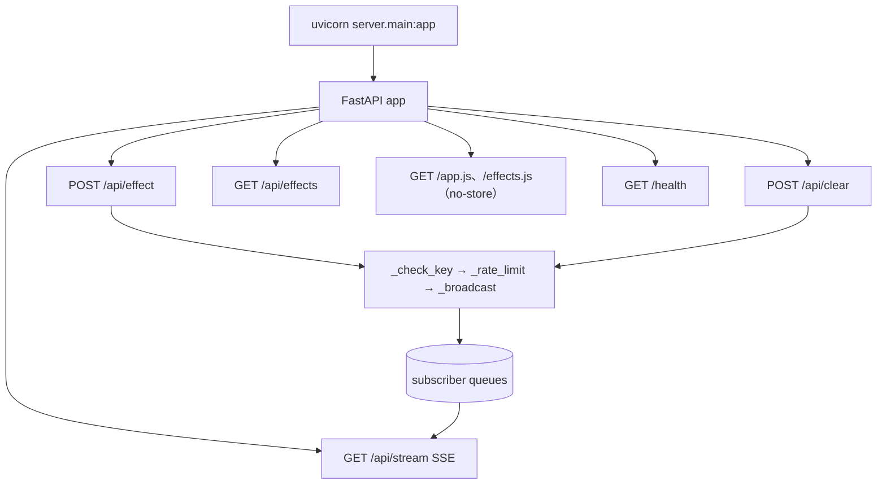
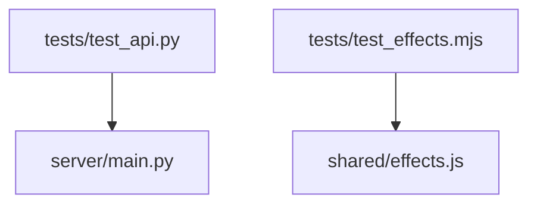

# Real-time Interaction html 函式呼叫關係圖

## 模組責任

| 模組 | 主要責任 |
| --- | --- |
| `server/main.py` | 中繼後端（FastAPI）：驗證、限頻、SSE 廣播、提供 `/app.js`、`/effects.js`（附 `Cache-Control: no-store`，避免瀏覽器快取舊版腳本） |
| `shared/effects.js` | 特效定義與動畫計算（particle/ripple/firework/text）、座標換算、`stepEffect` 牆時推進（substep ≤50ms）；browser/node 雙用（UMD） |
| `shared/app.js` | 顯示端嵌入腳本：canvas 疊層（pointer-events: none）、SSE 訂閱（狀態切換才 log）、rAF＋setInterval 雙驅動渲染迴圈（特效以 born/elapsed 牆時計時，背景分頁不凍結；**每 tick 先移除完成特效 → clearRect → 重繪全部 active**，canvas 為當下狀態純函數，無殘影/像素累積）、啟動 log 版本標記 v3（可於 F12 確認載入版本） |
| `console/index.html`＋`console/app.js` | 控制端：懸浮按鈕 `#fab` 展開/收合面板（預設收合，`#panel.open` 顯示）、**按住 `#fab` 拖曳移動**（位移 >8px 即啟動、無時間等待；`applyFabPos`：fab 與 panel 皆 clamp 於視窗內、`#panel` 跟隨、window resize 再 clamp）、特效選擇、參數設定、點擊座標 → POST server（點擊 `#fab`/`#panel` 不觸發發送；拖曳後之 click 被抑制不 toggle） |
| `viewer/index.html` | 顯示端獨立預覽頁（引用 shared/effects.js＋shared/app.js） |

## 1. 啟動與 server 端路由



## 2. 前端（console 控制、viewer 顯示）

```mermaid
flowchart TD
    A0[#fab click] --> A0a[panel.classList.toggle("open")＋fab active/aria-expanded]
    A0b[#fab 按住＋位移 >8px] --> A0c[drag.active → pointermove 拖曳]
    A0c --> A0d[applyFabPos：fab/panel 座標皆 clamp 視窗內＋panel 跟隨]
    A0d -. "pointerup 結束拖曳＋抑制隨後 click" .-> A0d
    A1[window click] --> A1a{target closest #panel/#fab?}
    A1a -- 是 --> A1b[ignore（不發送）]
    A1a -- 否 --> A2[console/app.js post /api/effect]
    A3[清屏按鈕] --> A4[console/app.js post /api/clear]
    S1[SSE event: effect] --> B1[shared/app.js handleEffect：born/elapsed 初始化]
    B1 --> B2[Effects.toPixels → Effects.createEffect]
    B2 --> B3[spawn → tick：stepEffect 牆時推進 → 移除完成特效 → clearRect → 重繪 active]
    B3 -. "rAF 前台平滑" .-> B3
    B3 -. "setInterval 100ms 背景補幀" .-> B3
    S2[SSE event: clear] --> B4[clearAll]
    S3[SSE event: ping] --> B5[lastPing 更新（離線偵測，逾時 log 一次）]
    S4[SSE open/error] --> B6[連線狀態切換 log（open→已連線、error→斷線重連中）]
```

## 3. 主要呼叫路徑（server）

| 路徑 | 說明 |
| --- | --- |
| `post_effect → _check_key → _rate_limit → _broadcast → queues → stream.generate` | 特效驗證並推送 |
| `post_clear → _check_key → _rate_limit → _broadcast → queues → stream.generate` | 清屏推送 |
| `stream → generate → queue.get(timeout=15) → event/ping` | SSE 串流；逾時發 ping 心跳 |
| `generate finally → _subscribers.discard` | 斷線清理訂閱 |

## 4. 測試關係



## 5. 未完成或未接線節點

| 節點 | 現況 |
| --- | --- |
| server 暫存最近 N 則（斷線重播） | 未實作（規格：預設不重播） |
| viewer 狀態回報（POST /api/status） | 未實作（規格：僅 log） |

執行測試：

```
python -m pytest tests/ -v
node --test tests/test_effects.mjs
```
