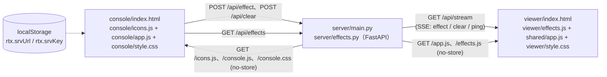
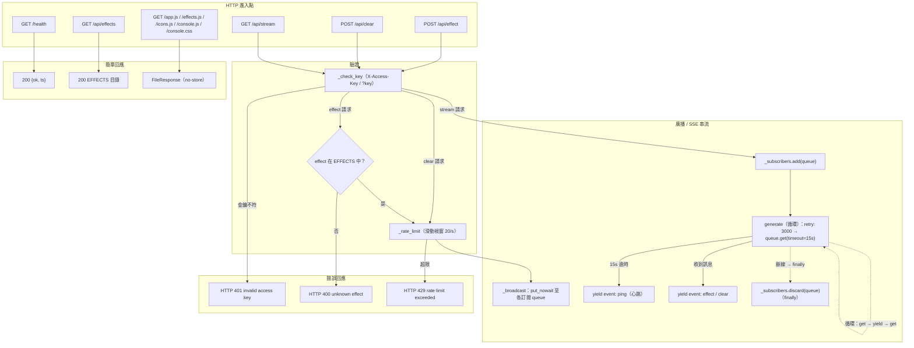
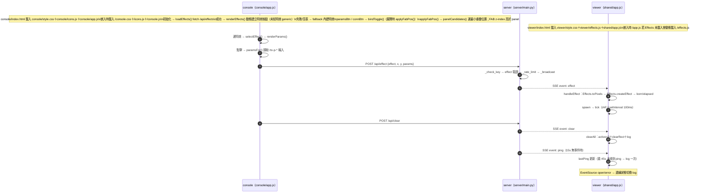
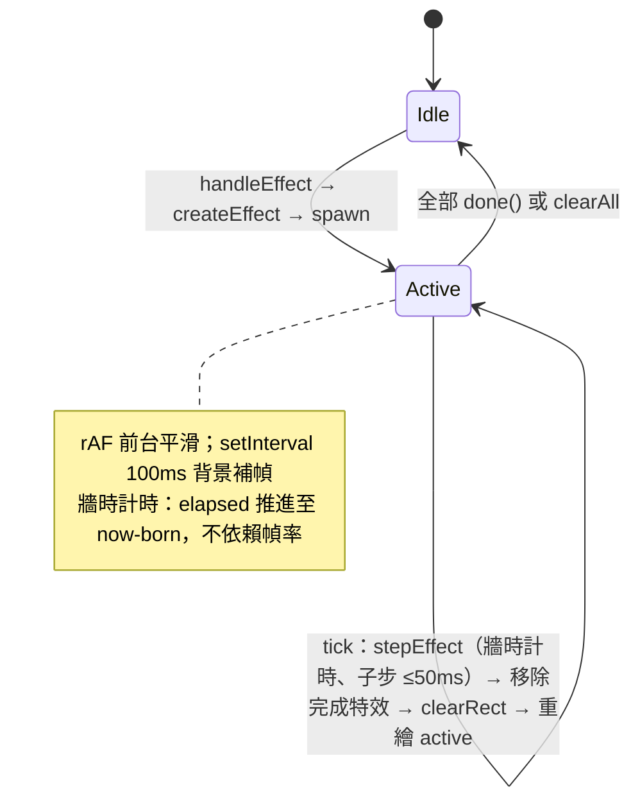
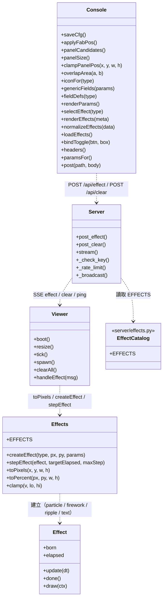
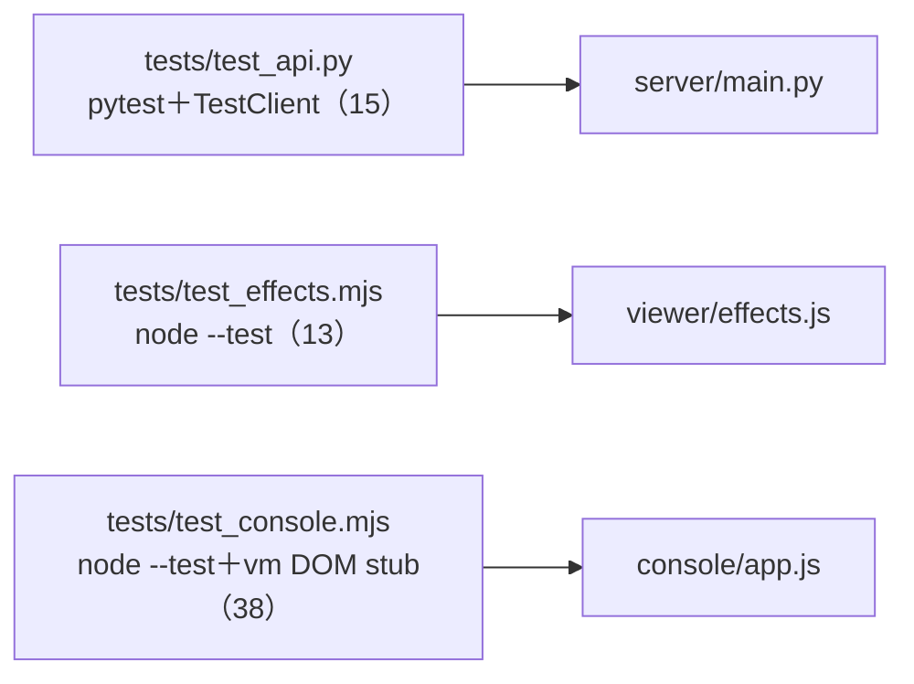

# Real-time Interaction html 函式呼叫關係圖

> 最後更新：2026-09-10

## 1. 整體架構



## 2. server 路由與請求驗證

> 節點依管線階層由上至下排列（進入點 → 驗證 → 廣播/串流），同階層以 subgraph 分組，錯誤回應與簡單回應各置獨立分組，避免關係線交錯。



## 3. 即時互動序列（console → server → viewer）



## 4. viewer 特效渲染生命週期



## 5. 模組依賴與主要呼叫路徑



## 6. 測試關係



## 7. 未完成或未接線節點

| 節點 | 現況 |
| --- | --- |
| server 暫存最近 N 則（斷線重播） | 未實作（規格：預設不重播） |
| viewer 狀態回報（POST /api/status） | 未實作（規格：僅 log） |

執行測試：

```
python -m pytest tests/ -v
node --test tests/test_effects.mjs tests/test_console.mjs
```
