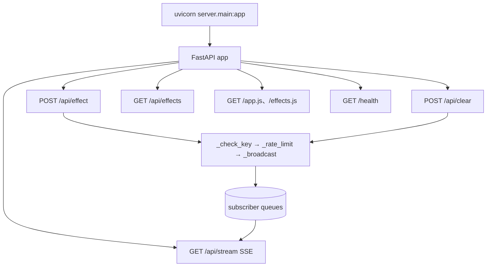
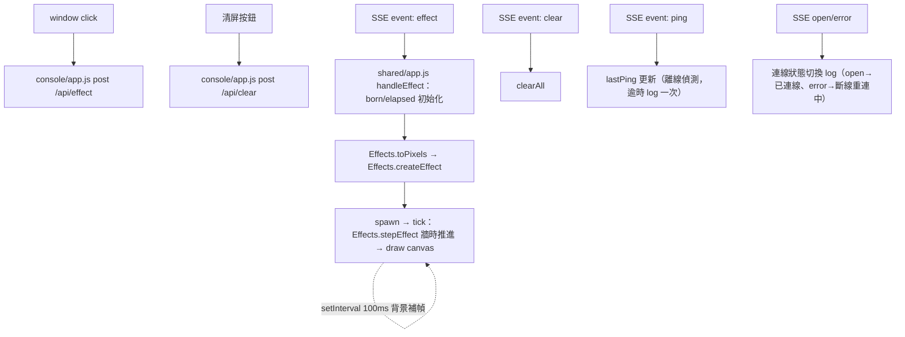
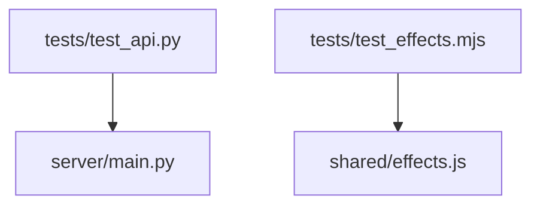

# Real-time Interaction html 函式呼叫關係圖

## 模組責任

| 模組 | 主要責任 |
| --- | --- |
| `server/main.py` | 中繼後端（FastAPI）：驗證、限頻、SSE 廣播、提供 `/app.js`、`/effects.js` |
| `shared/effects.js` | 特效定義與動畫計算（particle/ripple/firework/text）、座標換算、`stepEffect` 牆時推進（substep ≤50ms）；browser/node 雙用（UMD） |
| `shared/app.js` | 顯示端嵌入腳本：canvas 疊層（pointer-events: none）、SSE 訂閱（狀態切換才 log）、rAF＋setInterval 雙驅動渲染迴圈（特效以 born/elapsed 牆時計時，背景分頁不凍結） |
| `console/index.html`＋`console/app.js` | 控制端：特效選擇、參數設定、點擊座標 → POST server |
| `viewer/index.html` | 顯示端獨立預覽頁（引用 shared/effects.js＋shared/app.js） |

## 1. 啟動與 server 端路由



## 2. 前端（console 控制、viewer 顯示）



## 3. 主要呼叫路徑（server）

| 路徑 | 說明 |
| --- | --- |
| `post_effect → _check_key → _rate_limit → _broadcast → queues → stream.generate` | 特效驗證並推送 |
| `post_clear → _check_key → _rate_limit → _broadcast → queues → stream.generate` | 清屏推送 |
| `stream → generate → queue.get(timeout=15) → event/ping` | SSE 串流；逾時發 ping 心跳 |
| `generate finally → _subscribers.discard` | 斷線清理訂閱 |

## 4. 測試關係



## 5. 未完成或未接線節點

| 節點 | 現況 |
| --- | --- |
| server 暫存最近 N 則（斷線重播） | 未實作（規格：預設不重播） |
| viewer 狀態回報（POST /api/status） | 未實作（規格：僅 log） |

執行測試：

```
python -m pytest tests/ -v
node --test tests/test_effects.mjs
```
